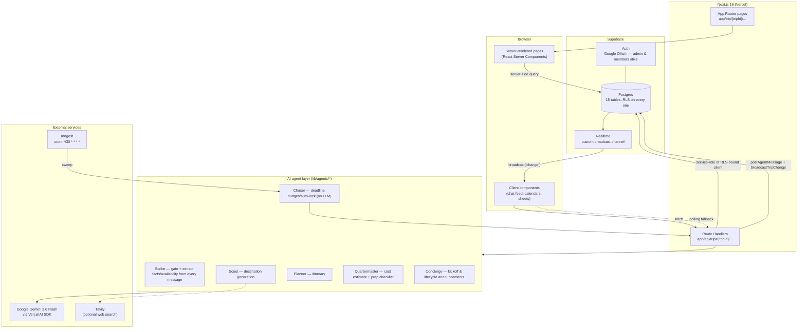
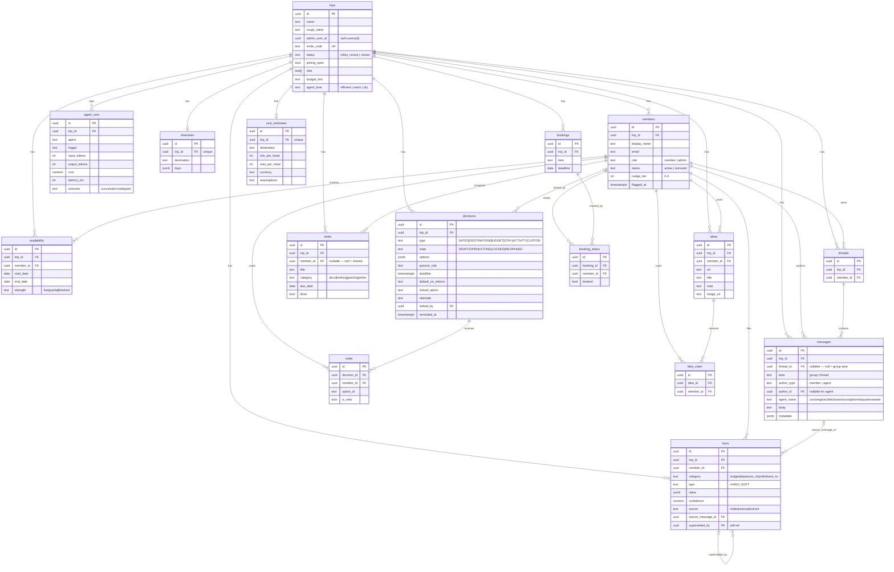

# 🧭 Caravan

**The agentic group trip planner.** Caravan replaces the unpaid "trip mom" inside every group chat — the one person who DMs everyone for dates, aggregates them by hand, proposes destinations, absorbs 200 forwarded reels, and sends the reminders — with a team of purpose-built AI agents living inside a shared trip room.

> One admin creates a trip and shares a code. Everyone else joins with Google, in about twenty seconds. The agents extract constraints from what people say, run the date math, force decisions to close, propose destinations with real reasoning, build the itinerary, and chase the stragglers — so the group chat converges on a plan instead of dying in a pile of "so are we doing this or not?"

[](https://nextjs.org)
[](https://www.typescriptlang.org)
[](https://supabase.com)
[](https://tailwindcss.com)
[](https://sdk.vercel.ai)
[](#testing)
[](LICENSE)

---

## Table of contents

- [Why Caravan exists](#why-caravan-exists)
- [Screenshots](#screenshots)
- [Feature tour](#feature-tour)
- [Tech stack](#tech-stack)
- [Architecture](#architecture)
- [The agents](#the-agents)
- [Database schema](#database-schema)
- [Getting started](#getting-started)
- [Project structure](#project-structure)
- [Testing](#testing)
- [Deployment](#deployment)
- [Design principles](#design-principles)
- [Known limitations / roadmap](#known-limitations--roadmap)
- [License](#license)

---

## Why Caravan exists

Group trips don't fail because chats don't capture information — they capture plenty. They fail because a group chat has **no mechanism to close a question**. "Anyone free the 2nd week of Dec?" gets four replies, two jokes, and then dies. Three weeks later someone asks "so are we doing this or not?" and the cycle restarts. Meanwhile prices go up and the window closes.

Caravan's product thesis rests on three bets:

1. **Convergence, not note-taking.** An agent that summarizes the chat is a toy. An agent that says *"3 of 5 want Goa, Rhea's budget caps things at ₹15k so Nov 12–15 beats Dec 20–24, voting closes Friday 6pm, silence counts as a yes"* is the organiser. Deadlines, quorum, and defaults-on-silence are the core mechanic — not the LLM.
2. **Private inputs, public consensus.** People don't say "I can't afford ₹20k" in a group of eight. Every member gets a private 1:1 lane with the agent — budgets and hard constraints go in privately; only the aggregate ("the plan needs to land under ₹16k/head") ever surfaces publicly.
3. **The state is the product, chat is just the input.** Dates, budget ceilings, the locked destination, the itinerary — these are real rows in a database with a lifecycle, not something buried thirty messages back.

---

## Screenshots

> **A note on this section:** the screens below describe each flow rather than embedding pixel screenshots, because this README was generated in an environment with no browser/screenshot tooling available. If you're picking this repo up, the fastest way to fill this in properly:
>
> 1. `npm run dev` and walk through each flow below in your own browser (or use `docs/design/screens.html` as a static visual reference for the original design intent — it's a self-contained mockup file you can open directly).
> 2. Drop screenshots into `docs/screenshots/` using the filenames suggested under each flow.
> 3. Replace the `> _(screenshot: ...)_` line under that flow with ``  ``.

### Onboarding & trip creation
- **Sign in** (`/sign-in`) — one Google button, real OAuth, no name/email form.
- **New trip wizard** (`/trips/new/basics` → `/trips/new/vibe` → `/trips/new/invite`) — name + intent, starting vibe + budget slider + agent tone, then the room code / invite link.
> _(screenshot: `docs/screenshots/new-trip-wizard.png`)_

### Lobby (admin + member)
- **Admin lobby** (`/trips/[tripId]/lobby`) — live member list as people join, copyable invite link, joining on/off toggle, gated "Open the room" (needs 3 people total, admin included) with a soft ambient glow and a live pulse indicator.
- **Member lobby** (`/trip/[tripId]/member-lobby`) — "You're in" with an avatar stack of everyone already there, waits for the room to open, resilient to missed realtime events (polling fallback).
> _(screenshot: `docs/screenshots/admin-lobby.png`, `docs/screenshots/member-lobby.png`)_

### The five questions (private intake)
- `/trip/[tripId]/intake` — a 5-step private thread with the agent: when you're free (tri-state drag calendar), budget (slider, never shown to anyone else), departure city, vibe tags, hard nos. Each step has its own illustrated icon and color.
> _(screenshot: `docs/screenshots/intake-calendar.png`, `docs/screenshots/intake-budget.png`)_

### The Room (group chat)
- `/trip/[tripId]/room` — the shared feed: member messages, agent announcements (kickoff, decisions opening/locking/deleting, Scribe's "filed: ..." receipts), inline decision cards, a composer with link/vote/"ask the agent" actions.
> _(screenshot: `docs/screenshots/room.png`)_

### Plan (the command center)
- `/trip/[tripId]/plan` — trip snapshot: share card, party roster with intake status, date windows, budget ceiling, a link into everyone's answers, a link into "Where are we going," inline DATES/CUSTOM decisions, itinerary, prep checklist, bookings, ideas, cost.
> _(screenshot: `docs/screenshots/plan.png`)_

### Where are we going (destination)
- `/trip/[tripId]/destination` — Scout's three gradient-hero destination options, each with cost/travel-time/why-it-fits/who-it-fits-worst, vote/veto/lock actions, admin delete.
> _(screenshot: `docs/screenshots/destination.png`)_

### Everyone's answers (facts)
- `/trip/[tripId]/facts` — one card per member, emoji chips grouped by category (departure city, vibe, hard nos), budget always excluded. A category simply doesn't render for someone who hasn't filed anything in it.
> _(screenshot: `docs/screenshots/facts.png`)_

### Bookings, Ideas, Cost
- `/trip/[tripId]/bookings` — flight/hotel/etc. tracked per item, a chip per member showing who's booked, nudge unbooked members.
- `/trip/[tripId]/ideas` — paste a link (Instagram/YouTube/blog/anything), it turns into a card, upvote/downvote.
- `/trip/[tripId]/cost` — Quartermaster's per-head range against the locked destination, and how many people it pushes over their (still-private) ceiling.
> _(screenshot: `docs/screenshots/bookings.png`, `docs/screenshots/ideas.png`, `docs/screenshots/cost.png`)_

### You (personal thread) & Settings
- `/trip/[tripId]/you` — your 1:1 thread with the agent, your own filed facts, your tasks.
- `/trip/[tripId]/settings` — joining toggle + invite link, member list with admin remove, locked-decision reopen, danger zone (delete the trip).
> _(screenshot: `docs/screenshots/you.png`, `docs/screenshots/settings.png`)_

---

## Feature tour

### Onboarding & identity
- Google OAuth for **everyone** — admin and members alike — via Supabase Auth. No name/email form, no separate guest-JWT system.
- Invite by code *or* link (`/join/[code]`); if you're already signed in, clicking the link drops you straight into the lobby.
- Joining can be shut off mid-lobby without kicking anyone already in.

### The room
- Shared group chat with a visually distinct agent lane (kickoff messages, decision lifecycle announcements, Scribe's "filed: ..." receipts).
- **Threads** — a private 1:1 lane per member with the agent (intake happens here; "ask the agent" questions land here too).
- Composer actions: paste a link → files it as an Idea; put something to a vote; ask the agent a plain-language question about costs/dates/who's said what.
- Realtime everywhere via a custom Supabase broadcast channel (not just `postgres_changes`, which under RLS only ever reaches the trip's admin — see [Architecture](#architecture)), with a polling safety net so nobody's screen can get permanently stuck.

### The five questions (private intake)
- Tri-state drag-to-select availability calendar (free / tight / can't).
- Budget slider, ₹5k–₹2L, with one-tap presets — **never shown to anyone, including the admin**. Only the aggregated group ceiling (the tightest submitted number) ever surfaces.
- Departure city, vibe tags, hard nos (with one-tap common suggestions).
- The agent "confirms what it heard" back in your thread instead of a silent form-save.

### Continuous extraction from chat
- **Scribe** gates every group/thread message ("does this contain a constraint, date, budget, or preference?") before spending a full extraction call on it.
- Extracted facts/availability are attributed only to their own author, filed at a confidence floor, and a receipt is posted back.
- A later chat correction — either direction ("actually I can't make the 5th" or "turns out I can now") — properly overrides an earlier answer: availability resolves per-day by *recency*, and budget/departure-city facts get superseded by the newer statement instead of sitting alongside a stale one.

### Decisions
- Five types: **DATES, DESTINATION, BUDGET, STAY, ACTIVITY, CUSTOM**. Vote, veto ("hard no" — can never be voted away), lock.
- Deterministic date solver: slides a window across everyone's submitted availability, scores by attendance, and collapses consecutive identical-scoring candidates into one real option instead of chopping one comfortable stretch into arbitrary slices.
- Locking with a hard-no conflict shows the admin the runner-up and requires an explicit, logged override to force it anyway.
- Deadlines auto-lock and nudge non-responders via a scheduled sweep (Chaser) — pure rule-based, no LLM.
- Admin can delete any decision (locked or not); the agent announces the deletion in the room and invites the group to discuss and regenerate.

### Destination generation (Scout)
- Gated on having at least one real budget answer — never proposes from thin constraints.
- Weighs the group's aggregated budget ceiling, departure cities, vibe tags, hard nos, **and the trip's own name/original pitch** (so a trip literally called "Bali 2027" doesn't get ignored just because nobody's intake happened to mention it).
- Optional live web research via Tavily; works without it, just with less current pricing/context.
- Three options, each with cost/head, door-to-door travel time, why it fits this specific group, and an honest "who it fits worst."

### Itinerary, cost, checklist
- **Planner** builds a day-by-day itinerary once a destination is locked, paced to the group's vibe.
- **Quartermaster** estimates a per-head cost range for the locked destination and deterministically flags how many members it pushes over their (still-private) ceiling — the LLM estimates, arithmetic decides who's over.
- **Quartermaster** also generates a prep checklist (docs / bookings / packing / other), personal + shared.

### Bookings & Ideas
- Track logistics items (flights, hotels, ...) with a per-member "booked" chip and one-tap nudges.
- An inbox for pasted links (Instagram/YouTube/anything) that becomes a votable card.
- Both fully admin-deletable behind a destructive confirm, same as decisions.

### Member management
- Admin can remove a member — and it's a *real* removal: their facts, availability, votes, idea votes, and booking status are erased, and anything not locked in yet (an open destination vote, a cost estimate) is regenerated so the result reflects who's actually still in the group.
- Admin can delete the entire trip — a genuine hard delete (every child table cascades off `trips.id`), gated behind a destructive confirm.
- The room only opens once there are at least 3 people total (admin included) — a 1-2 person "group" doesn't need a coordination agent.

### UI polish
- Illustrated, distinctly-themed empty states across every screen (no page ever renders a bare "nothing here" line).
- `loading.tsx` skeletons on every route segment that fetches before first paint.
- In-app confirm sheets for every destructive action (no native `window.confirm`).
- A tri-state calendar, a real budget slider, destination cards matching the original hi-fi mockups.

---

## Tech stack

| Layer | Choice | Notes |
|---|---|---|
| Framework | **Next.js 16** (App Router) | Server Components for data-heavy pages, Route Handlers for mutations |
| Language | **TypeScript 5** (strict) | |
| UI | **React 19**, **Tailwind CSS v4** (`@theme` tokens), `tw-animate-css`, `lucide-react` | Warm paper/plum/signal-green design system, hand-drawn SVG illustrations, no external UI kit |
| Backend / DB | **Supabase** — Postgres, Auth (Google OAuth), Realtime | Row-Level Security everywhere; a custom broadcast layer covers what RLS-gated `postgres_changes` can't reach for members (see [Architecture](#architecture)) |
| AI | **Vercel AI SDK v7** + **Google Gemini 3.6 Flash** (`@ai-sdk/google`) | One model across every agent; `generateObject` for structured output, `generateText` for the Q&A surface |
| Search | **Tavily API** (optional) | Live web context for Scout's destination research; the app degrades gracefully without it |
| Background jobs | **Inngest** | Cron-driven Chaser sweep (deadline nudges/auto-lock), every 30 minutes |
| Validation | **Zod 4** | Every mutating API route parses its body through a schema in `lib/validation.ts` |
| Testing | **Vitest** | 253 tests across 54 files — pure logic and API routes are unit-tested; no component/E2E layer yet |

---

## Architecture



**Why a custom broadcast layer instead of just `postgres_changes`:** every RLS policy on `messages`, `decisions`, `votes`, etc. grants `SELECT` to a trip's own `admin_user_id` — never to a plain member, even though members now authenticate through real Supabase Auth sessions too. Rather than loosen RLS, mutating routes explicitly `broadcast()` a `{type, ...payload}` event on a per-trip channel after every write, and every page that needs to feel "live" (the room, both lobbies, Plan via `RealtimeRefresh`) subscribes to it — with an interval-based polling fallback wherever a missed broadcast would otherwise leave a screen stuck (both lobbies).

**Auth model:** a single `getAuthUser()` (Supabase Auth session) answers "who's signed in" for both audiences. `resolveCaller(tripId)` does one lookup — auth user → that trip's `members` row by email — and returns `{ id, status, role }`; `role` is the one source of truth for admin-only UI/actions inside any page both audiences can reach. `requireTripOwner(tripId)` is the separate, stricter check for service-role routes that bypass RLS entirely (member management, trip deletion, decision deletion, Scout/Planner/Quartermaster generation) — it independently verifies `trips.admin_user_id === auth.uid()` since the service client gets no RLS protection for free.

---

## The agents

Every agent follows the same **deterministic core, LLM shell** principle: anything with a right answer (date math, quorum, who's over budget, when to auto-lock) is plain arithmetic; the LLM is only ever the one deciding *what to say* or *what to propose*, never the one deciding *who's right*.

| Agent | Posts as | Trigger | What it does | LLM? |
|---|---|---|---|---|
| **Concierge** | `concierge` | Room opens, decision opened/locked/reopened/deleted, intake submitted | Narrates lifecycle events into the room/thread with a receipt — nothing happens silently | No — templated |
| **Scribe** | `scribe` | Every new message | Gates ("does this contain extractable info?"), then extracts facts/availability attributed to the author only, files them, posts a receipt | Yes — gate + extraction |
| **Scout** | `scout` | Admin requests destination options | Deterministic budget-ceiling gate → optional Tavily search → 3 destination options with cost/travel/reasoning, weighing the trip's own name/pitch alongside aggregated facts | Yes — `generateObject` |
| **Planner** | `planner` | Admin requests itinerary (destination must be locked) | Day-by-day itinerary paced to party size, vibe, hard constraints | Yes — `generateObject` |
| **Quartermaster** | `quartermaster` | Admin requests cost estimate / checklist | LLM estimates a per-head range; **deterministic** arithmetic (not the model) decides who's over budget. Also generates the prep checklist | Yes (estimate) + No (flagging) |
| **Chaser** | *(system, via Concierge-style messages)* | Cron, every 30 minutes | Pure rule sweep: deadline reminders inside a 24h window, auto-lock on expiry, nudge tiers for non-responders | No — pure rules |
| *(Q&A)* | — | "Ask the agent" from the composer | Answers plain-language questions about costs/dates/who's-said-what strictly from what the deterministic layer already computed — never does its own arithmetic | Yes — `generateText` |

---

## Database schema

15 tables, every one RLS-enabled, pulled directly from the live Supabase schema.



**Notable design choices in the schema itself:**
- `facts.superseded_by` is a self-referencing FK — a chat correction to a "current answer" category (budget, departure city) supersedes the prior fact rather than sitting alongside it; additive categories (vibe, hard_no) are left alone on purpose.
- `messages.lane` + `thread_id` is how the group feed and every member's private 1:1 thread share one table without ever leaking into each other.
- `agent_runs` is a full LLM observability log — tokens, estimated cost, latency, outcome — per call, per agent, per trip.
- Every child table cascades on `trip_id` (`on delete cascade`), which is what makes trip deletion a genuine one-shot teardown with zero orphaned rows.

---

## Getting started

### Prerequisites
- Node.js 20+
- A [Supabase](https://supabase.com) project
- A [Google Gemini API key](https://aistudio.google.com/apikey)
- A Google OAuth client, for Supabase Auth's Google provider (steps below)
- *(optional)* A [Tavily](https://app.tavily.com) API key for live destination research
- *(optional, production only)* An [Inngest](https://inngest.com) account, for the Chaser cron

### 1. Clone and install

```bash
git clone <this-repo>
cd caravan
npm install
cp .env.example .env.local
```

### 2. Supabase — database + auth

1. Create a project at [supabase.com](https://supabase.com).
2. Run every file in `supabase/migrations/` against it, **in filename order** — either `supabase db push` via the [Supabase CLI](https://supabase.com/docs/guides/local-development/cli/getting-started), or paste each one into the dashboard's SQL editor.
3. From **Project Settings → API**, copy the project URL, the `anon` public key, and the `service_role` key into `.env.local` (below). The service-role key is server-only — it bypasses RLS and must never reach the client.

### 3. Google OAuth — where the client ID/secret actually live

**They don't go in this codebase at all** — not in a file, not in an env var. Supabase Auth owns the entire OAuth handshake with Google; the app only ever calls `supabase.auth.signInWithOAuth({ provider: "google" })` and lets Supabase redirect, exchange the code, and hand back a session. That's why a `grep` for `client_id`/`clientId` across this repo turns up nothing — it's not a gap, that credential simply has no reason to ever touch application code.

1. In [Google Cloud Console](https://console.cloud.google.com/apis/credentials), create an **OAuth 2.0 Client ID** (Application type: **Web application**).
2. Under **Authorized redirect URIs**, add your Supabase project's own callback — **not** this app's `/auth/callback` route:
   ```
   https://<your-project-ref>.supabase.co/auth/v1/callback
   ```
3. In the Supabase dashboard, go to **Authentication → Sign In / Providers → Google**, toggle it on, and paste the **Client ID** and **Client Secret** from step 1 there. This is the one and only place those two values are ever configured.
4. Separately, in **Authentication → URL Configuration**, add this app's own callback as an allowed redirect URL (this is the one Supabase-related URL that *is* referenced in code, in `app/auth/callback/route.ts`):
   ```
   http://localhost:3000/auth/callback        # dev
   https://<your-domain>/auth/callback         # production
   ```

### 4. Environment variables

Fill in `.env.local`:

```bash
NEXT_PUBLIC_SUPABASE_URL=          # your Supabase project URL
NEXT_PUBLIC_SUPABASE_ANON_KEY=     # Supabase public anon key
SUPABASE_SERVICE_ROLE_KEY=         # Supabase service role key (server-only, never exposed to the client)
GOOGLE_GENERATIVE_AI_API_KEY=      # Gemini key from https://aistudio.google.com/apikey
TAVILY_API_KEY=                    # optional — Scout works without it, just with less live context
```

Nothing Inngest- or Google-OAuth-client-related belongs in this file — see §3 above for Google, and §5 below for Inngest.

### 5. Inngest — where the cron setup goes

The whole integration is two files: `lib/inngest/client.ts` (defines the client + the trip ID) and `app/api/inngest/route.ts` (the single HTTP endpoint — `serve()` from the `inngest/next` package turns it into `GET`/`POST`/`PUT` handlers). `lib/inngest/functions.ts` defines the actual cron job (`chaser-sweep`, `*/30 * * * *`).

- **Local dev:** run the Inngest Dev Server alongside `next dev` — it auto-discovers `/api/inngest` with zero config, no env vars needed:
  ```bash
  npx inngest-cli@latest dev
  ```
- **Production:** create an app at [app.inngest.com](https://app.inngest.com), point it at your deployed `/api/inngest` URL, and set these two on your host (Vercel dashboard, etc.) — the SDK picks them up from `process.env` automatically, there's no code change:
  ```bash
  INNGEST_EVENT_KEY=
  INNGEST_SIGNING_KEY=
  ```
  Without these set in production, the endpoint still exists but Inngest Cloud can't authenticate to it, so the Chaser sweep silently never fires — decisions with deadlines just won't auto-lock or nudge.

### 6. Run it

```bash
npm run dev       # start the dev server
npm test          # run the Vitest suite
npm run lint       # ESLint
npm run build      # production build
```

---

## Project structure

```
app/
  trips/                       # my-trips list, new-trip wizard, admin lobby
  trip/[tripId]/
    intake/                    # the 5 private questions
    member-lobby/               # member's pre-open waiting screen
    (main)/                     # everything behind the trip shell (tab bar + sidebar)
      room/ plan/ you/ settings/
      destination/ facts/ bookings/ ideas/ cost/
      decisions/[decisionId]/
  join/[code]/                 # invite landing → OAuth → auto-join → redirect
  api/trips/[tripId]/...       # every mutation: decisions, votes, intake, ideas,
                                #   bookings, member removal, scout/planner/quartermaster
components/caravan/            # the whole design system — cards, sheets, chips,
                                #   illustrations, the calendar, decision cards
lib/
  agents/                      # Scribe, Scout, Planner, Quartermaster, Chaser, model config
  auth/                        # session + caller resolution
  supabase/                    # browser / server / service-role clients
  realtime/                    # the custom broadcast layer
  date-solver.ts, budget.ts, cost-flags.ts, tally-votes.ts   # the deterministic core
  validation.ts                # every Zod schema
  database.types.ts            # hand-maintained row types for every table
supabase/migrations/           # 11 migrations, schema history
docs/design/                   # PRD, UI spec, and a static HTML hi-fi mockup (screens.html)
```

---

## Testing

```bash
npm test
```

253 tests across 54 files. The test strategy follows the deterministic-core/LLM-shell split: pure logic (`lib/date-solver.ts`, `lib/budget.ts`, `lib/tally-votes.ts`, `lib/cost-flags.ts`, `lib/agents/chaser-rules.ts`, ...) and every API route are unit-tested with mocked Supabase/AI-SDK clients; agent LLM calls are tested for their deterministic surrounding logic (gating, prompt construction, fact filing, error handling), not for model output itself. There's no component or end-to-end browser test layer yet — see [Known limitations](#known-limitations--roadmap).

---

## Deployment

Built for [Vercel](https://vercel.com):

1. Import the repo, set the environment variables above in the Vercel dashboard.
2. Point `NEXT_PUBLIC_SUPABASE_URL` / keys at your production Supabase project (run migrations there too).
3. Add your production URL's `/auth/callback` (`https://<your-domain>/auth/callback`) to Supabase's **Authentication → URL Configuration** allowed redirects — the Google Cloud Console side doesn't change per-deployment, it always points at Supabase's own callback (see [§3 above](#3-google-oauth--where-the-client-idsecret-actually-live)).
4. Set `INNGEST_EVENT_KEY` / `INNGEST_SIGNING_KEY` and point an Inngest app at `/api/inngest` (see [§5 above](#5-inngest--where-the-cron-setup-goes)) so the Chaser sweep actually fires every 30 minutes in production.

---

## Design principles

These held across the whole build and are worth knowing before extending it:

- **Deterministic core, LLM shell** (the load-bearing one). Date math, quorum, budget-over/under, auto-lock timing — plain code. The LLM only ever writes destination reasoning, itinerary content, and chat replies; it's never the thing deciding whether someone's over budget.
- **Private inputs, public consensus.** Budget is the one piece of data that never surfaces to anyone but its owner, anywhere in the product — not the admin, not a debug view, not an "everyone's answers" page.
- **Nothing happens silently.** Every state change — a decision locking, reopening, or being deleted; a member being removed; a fact getting corrected — posts a receipt into the room or thread it affects.
- **The room only opens once there's a group.** A trip stays in `lobby` until an explicit admin action, and that action itself is gated (3+ people) — no slow trickle-in, no half-empty room making decisions.

---

## Known limitations / roadmap

Kept here on purpose so this stays an honest README, not a marketing page:

- **No email/push notifications yet.** Some UI copy ("you'll get an email") is aspirational — nudges currently surface only inside the app (room messages, `nudge_tier`), there's no actual email delivery wired up.
- **No component or E2E test layer.** Coverage is strong on logic and API routes; UI regressions have to be caught by hand.
- **Itinerary is regenerate-only.** Planner rebuilds the whole itinerary each time rather than supporting inline day edits.
- **Single AI provider.** Everything runs on one Gemini model; swapping providers/tiers per-agent is a one-line change (the AI SDK abstracts it) but isn't wired up as a runtime option.
- **No dark theme.** The design system is a single warm paper/plum palette.

---

## License

[MIT](LICENSE) — do what you want with it, including in production, with attribution and no warranty.
